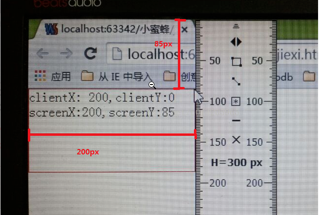

#### 滑动时间回弹Demo
--------------------
**知识点**
1. 移动端滑动事件 
--------------------
事件名|事件描述|
--|:--:|
touchstart|滑动开始，即手机触碰屏幕|
touchmove|滑动事件进行中|
touchend|滑动事件结束|
2. changedTouches参数
[移动端Touch事件](http://caibaojian.com/mobile-touch-event.html)
---------------------
属性名|属性描述|
--|:--:|
clientY|相对于视口（可视区域）的 Y 轴的位置
screenY|相对于显示器屏幕的 Y 轴的位置
---------------------
 
---------------------
3. offsetHeight
[height、clientHeight、scrollHeight、offsetHeight](http://www.cnblogs.com/yuteng/articles/1894578.html)
---------------------
属性名|属性描述|获取方式
--|:--:|--
height|属于对象style的对象属性，值是字符串类型|element.style.height
clientHeight|可见区域的高度，**不包括border的宽度，若有滚动条，应减去滚动条高度（17px）**|若没有滚动条，值和height相同
scrollHeight|略。。。|略。。。
offsetHeight|....全部的高度之和|clientHeight + 滚动条 + border

